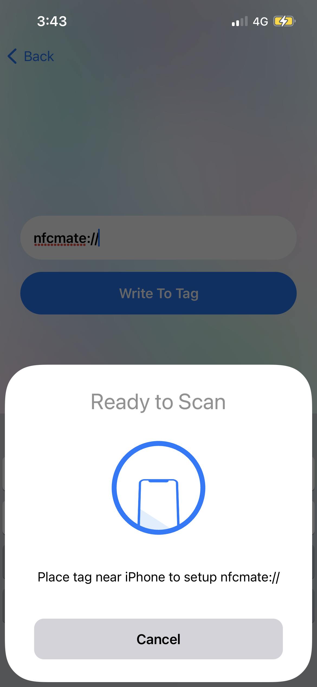
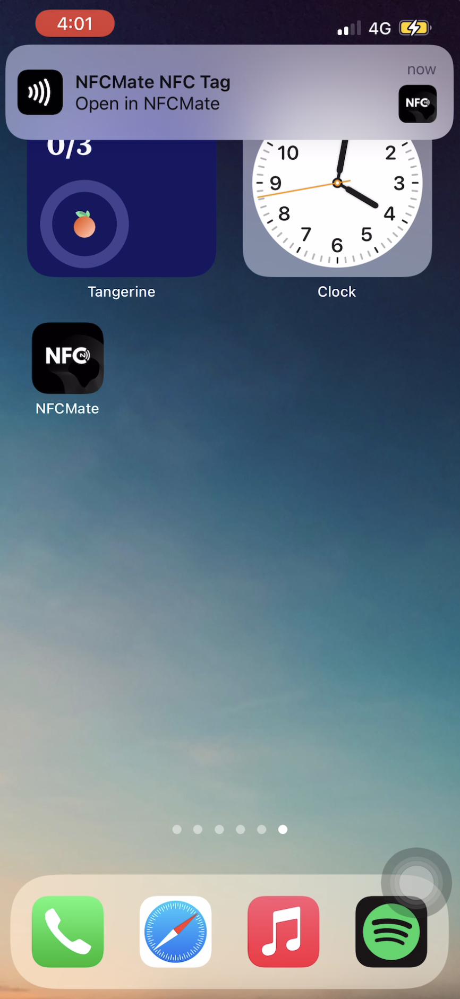
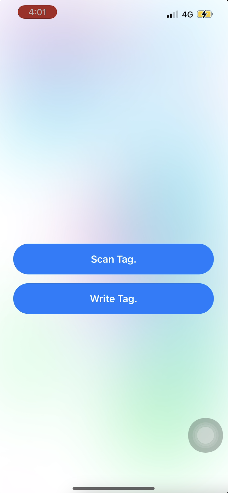
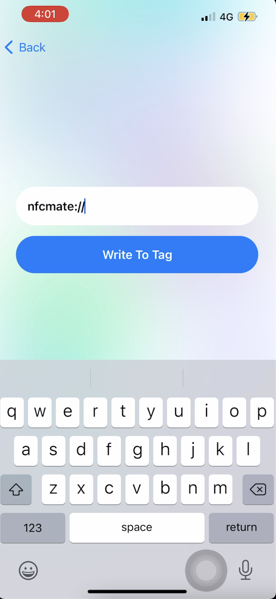

# NFCMate
### NFCMate
**```NFCMate```** is a NFC app written in Swift for iOS devices. Moreover, it uses a Universal Links that provides seamless integration between scanning the tags and the dataflow with the app, providing users a seamless experience.


<p align="center">
  
  
</p>

<p align="center">
  
  
</p>

### Requirements
- Xcode version 12+
- Swift 5
- iPhone 6s or higher
- iOS 14.0+
- NFC Tags
- Apple Developer Account
https://medium.com/avantaventures/the-future-of-refrigerated-logistics-is-digital-e89e00cd6b9e
